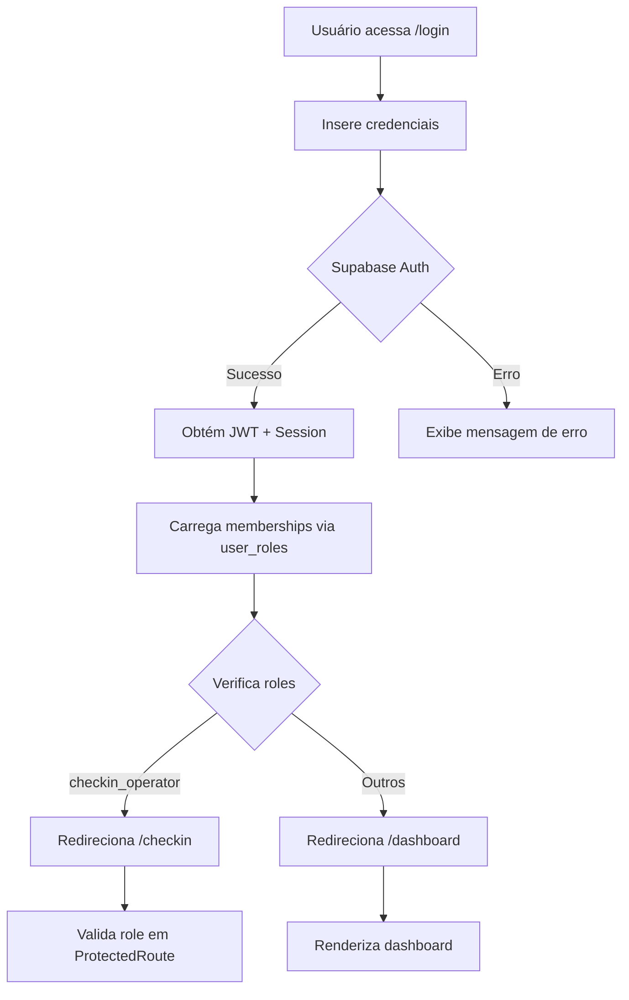

# Autenticação Multi-tenant e RBAC - Implementação Completa

## 📋 Resumo Executivo

Implementação completa de autenticação multi-tenant com RBAC (Role-Based Access Control) usando Supabase Auth e Edge Functions administrativas.

**Status**: ✅ Pronto para testes  
**Data**: 2025-02-02

---

## 🏗️ Arquivos Criados/Modificados

### Frontend

#### Contexto e Autenticação
- `src/contexts/AuthContext.tsx` - Provider de autenticação com gerenciamento de sessão
- `src/services/auth.ts` - Serviços de autenticação (signIn, signOut, fetchMe)
- `src/services/admin.ts` - Serviços administrativos (createOperator, assignRole)

#### Componentes e Guards
- `src/components/auth/ProtectedRoute.tsx` - Guard para rotas protegidas com validação de roles

#### Páginas
- `src/pages/Login.tsx` - Tela de login (reutilizável para portal geral e check-in)
- `src/pages/Dashboard.tsx` - Dashboard do usuário autenticado
- `src/pages/Dashboard/Operators.tsx` - Gestão de operadores (admin only)
- `src/pages/Checkin.tsx` - Portal do operador de check-in
- `src/App.tsx` - Atualizado com rotas protegidas e AuthProvider

### Backend (Edge Functions)

- `supabase/functions/operators-create/index.ts` - Criação de operadores
- `supabase/functions/roles-assign/index.ts` - Atribuição de roles

---

## 🔐 Edge Functions Disponíveis

### 1. POST /functions/v1/operators-create

**Permissão**: `organizer_admin` ou `admin_saas`

**Headers**:
```
Authorization: Bearer <JWT>
Content-Type: application/json
```

**Request Body**:
```json
{
  "email": "operador@exemplo.com",
  "nome": "João Silva",
  "tenantId": "11111111-1111-1111-1111-111111111111"
}
```

**Response (200)**:
```json
{
  "userId": "uuid-gerado",
  "tempPassword": "Check12345678!"
}
```

**Fluxo Interno**:
1. Valida autenticação do caller
2. Verifica se caller tem role `organizer_admin` ou `admin_saas` no tenant
3. Cria usuário no Supabase Auth com senha temporária
4. Insere registro em `app_users` (id, tenant_id, nome, email)
5. Insere em `user_roles` com role `checkin_operator`
6. Retorna userId e tempPassword
7. Em caso de erro, faz rollback (deleta usuário criado)

### 2. POST /functions/v1/roles-assign

**Permissão**: `organizer_admin` ou `admin_saas`

**Headers**:
```
Authorization: Bearer <JWT>
Content-Type: application/json
```

**Request Body**:
```json
{
  "userId": "uuid-do-usuario",
  "tenantId": "11111111-1111-1111-1111-111111111111",
  "role": "checkin_operator"
}
```

**Roles Permitidas**: `organizer_staff`, `checkin_operator`, `buyer`

**Response (200)**:
```json
{
  "success": true
}
```

**Fluxo Interno**:
1. Valida autenticação
2. Verifica permissões do caller
3. Valida role solicitada (não permite `admin_saas`)
4. Faz upsert em `user_roles`

---

## 🛣️ Rotas Implementadas

| Rota | Proteção | Role Requerida | Descrição |
|------|----------|----------------|-----------|
| `/` | 🌐 Pública | - | Home page |
| `/login` | 🌐 Pública | - | Login geral e portal check-in |
| `/dashboard` | 🔒 Autenticada | - | Dashboard do usuário |
| `/dashboard/operators` | 🔒 Autenticada | `organizer_admin`<br>`admin_saas` | Criação de operadores |
| `/checkin` | 🔒 Autenticada | `checkin_operator` | Portal de check-in |

---

## 🧪 Passo a Passo para Testes

### Teste 1: Criar Operador (como Admin)

**IMPORTANTE**: Use os dados de seed criados na Etapa 1:

```bash
# IDs de Seed
TENANT_ID: 11111111-1111-1111-1111-111111111111
ADMIN_USER_ID: 22222222-2222-2222-2222-222222222222
OPERATOR_USER_ID: 33333333-3333-3333-3333-333333333333
```

**Passos**:
1. Acesse `/login`
2. Entre com credenciais do admin seed (você precisará criar este usuário no Auth manualmente ou via script)
3. Vá para `/dashboard`
4. Clique em "Gerenciar Operadores"
5. Preencha:
   - **Nome**: Operador Teste
   - **Email**: operador.teste@exemplo.com
6. Clique em "Criar Operador"
7. **Anote a senha temporária** exibida na tela

### Teste 2: Login como Operador

1. Faça logout
2. Acesse `/checkin` (será redirecionado para login)
3. Entre com:
   - **Email**: operador.teste@exemplo.com
   - **Senha**: (senha temporária do teste anterior)
4. Deve ser redirecionado para `/checkin`
5. Verifique o portal de check-in

### Teste 3: Validar Restrições

**Cenário A: Operador tenta acessar gestão de operadores**
- Login como operador
- Tente acessar `/dashboard/operators`
- **Esperado**: Acesso negado

**Cenário B: Admin tenta acessar portal de check-in**
- Login como admin (sem role `checkin_operator`)
- Tente acessar `/checkin`
- **Esperado**: Mensagem "Acesso Negado"

**Cenário C: Acesso sem autenticação**
- Logout
- Tente acessar `/dashboard` ou `/checkin`
- **Esperado**: Redirecionado para `/login`

---

## 🔒 Validações de Segurança Implementadas

### Edge Functions
✅ **Autenticação obrigatória** via JWT  
✅ **Autorização por role** no tenant específico  
✅ **Service role** usado apenas no servidor (nunca exposto)  
✅ **Validação de inputs** (campos obrigatórios)  
✅ **Rollback automático** em caso de erro  
✅ **Logs detalhados** de erros  
✅ **CORS headers** configurados  

### Frontend
✅ **Session management** com Supabase  
✅ **Protected routes** com guards  
✅ **Role-based access control**  
✅ **Error handling** com toast feedback  
✅ **Loading states** em operações assíncronas  
✅ **Redirect inteligente** baseado em role após login  

### RLS (Row Level Security)
✅ **app_users**: usuário vê apenas próprio registro ou se admin do tenant  
✅ **user_roles**: apenas admins do tenant podem gerenciar  
✅ **Funções helper**: `has_role()`, `is_tenant_admin()`, `has_tenant_access()`  

---

## 📊 Estrutura de Dados

### Tabela: user_roles
```sql
CREATE TABLE user_roles (
  user_id UUID REFERENCES auth.users(id) ON DELETE CASCADE,
  tenant_id UUID REFERENCES tenants(id) ON DELETE CASCADE,
  role role_type NOT NULL,
  PRIMARY KEY (user_id, tenant_id)
);
```

### Enum: role_type
```sql
CREATE TYPE role_type AS ENUM (
  'admin_saas',
  'organizer_admin',
  'organizer_staff',
  'checkin_operator',
  'buyer'
);
```

---

## 🔄 Fluxo de Autenticação



---

## 🚀 Próximas Etapas

### Etapa Imediata
- [ ] Implementar troca de senha no primeiro login
- [ ] Adicionar reset de senha via e-mail
- [ ] Criar listagem de operadores criados

### Funcionalidade de Check-in
- [ ] Implementar validação de QR codes
- [ ] Sistema de registro de entrada
- [ ] Dashboard de estatísticas em tempo real

### Melhorias de UX
- [ ] Notificações push para operadores
- [ ] Histórico de ações administrativas
- [ ] Filtros e busca na lista de operadores

---

## 📝 Observações Importantes

1. **Service Key**: 
   - Automaticamente provida pelo ambiente Lovable Cloud
   - **NUNCA** expor no frontend
   - Usada apenas nas Edge Functions

2. **Multi-tenant**:
   - Todas as queries filtram por `tenant_id`
   - Isolamento total de dados entre tenants
   - Validação de acesso em cada operação

3. **Senha Temporária**:
   - Formato: `Check` + 8 caracteres aleatórios + `!`
   - Deve ser alterada no primeiro login (próxima implementação)
   - Exibida apenas uma vez na criação

4. **CORS**:
   - Configurado em todas Edge Functions
   - Permite chamadas do frontend

5. **Auth Flow**:
   - JWT gerenciado automaticamente pelo Supabase
   - Refresh automático de tokens
   - Session persistida em localStorage

---

## 🐛 Troubleshooting

### Erro: "Unauthorized" ao criar operador
**Causa**: Token JWT inválido ou expirado  
**Solução**: Fazer logout/login novamente

### Erro: "Insufficient permissions"
**Causa**: Usuário não tem role `organizer_admin` ou `admin_saas`  
**Solução**: Verificar roles na tabela `user_roles`

### Erro: "Missing authorization header"
**Causa**: Frontend não está enviando token  
**Solução**: Verificar se `supabase.auth.getSession()` está retornando sessão válida

### Operador não consegue acessar /checkin
**Causa**: Role `checkin_operator` não foi atribuída  
**Solução**: Verificar inserção em `user_roles` na Edge Function

---

## 📚 Referências

- [Supabase Auth Docs](https://supabase.com/docs/guides/auth)
- [Edge Functions](https://supabase.com/docs/guides/functions)
- [Row Level Security](https://supabase.com/docs/guides/auth/row-level-security)
- [React Router Protected Routes](https://reactrouter.com/en/main/start/concepts)

---

**Desenvolvido com Lovable Cloud** 🚀
